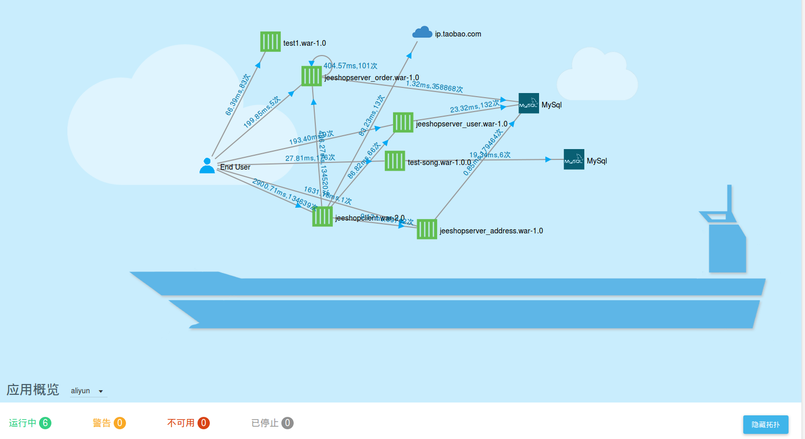

# SailingCloud

 ##关于SailingCloud
    Sailing Cloud是杭州云群科技有限公司研发的跨云端统一应用运维管理平台，基于目前最火的Docker容器和Kubernetes技术，关心您应用的服务质量。您可使用SailingCloud管理在不同云平台上的应用，不管是Amazon、Azure还是阿里云。针对中小创业团队缺少运维管理人员的特点，我们通过业界领先的Docker技术封装应用，提供应用一键构建、部署、发布、运维管理的一站式解决方案。除了日常的应用运维服务，Sailing Cloud关注您的应用的服务质量，我们提供的应用性能监控可有效追踪缺陷，并能及时修复BUG。 
    
    快来使用SailingCloud提供的跨云端统一运维服务吧！
    
   
    