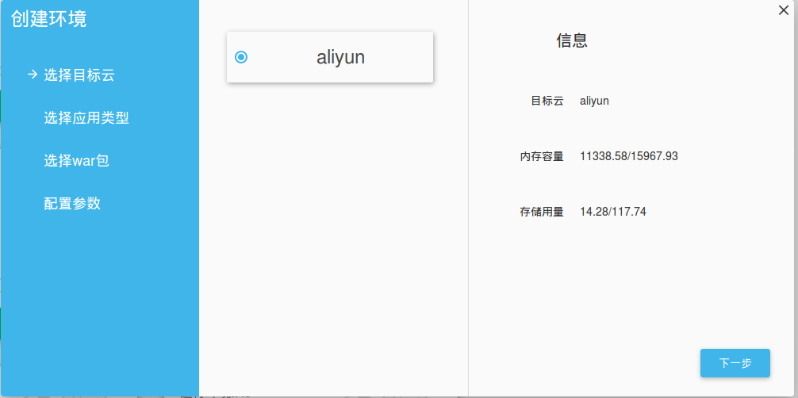

##创建第一个应用

用户完成账户注册和平台安装操作后，进入用户页面，默认进入应用列表页面，现在开始试着创建你的第一个应用，新用户应用列表为空，由于后续演示需求，演示帐号已有应用在运行。点击右下角蓝色控件，弹出两个按钮，分别是：新建应用按钮和War包管理按钮。点击+号按钮，新建应用:

弹出创建应用环境选项卡，用户需按步骤依次配置目标云、应用类型、War包和资源参数。
###选择目标云
该功能是Sailing Cloud一大特色，Sailing Cloud支持主流的IaaS服务提供商，如阿里云等，还可显示用户当前剩余的内存容量和存储容量，方便用户对IaaS资源池的容量有一个概括了解。

###选择应用类型
为应用选择语言框架，如Java、Python、Ruby等，举例，选择Java语言，选择JDK版本和Tomcat版本。

###选择War包
接下来配置War包，用户可从已有的War包列表中进行选择，或者上传一个新War包进行使用。

###配置参数
最后配置应用的资源参数，如环境名称、域名、硬盘、内存、CPU和实例数，除了环境名称需要手动输入，其他选项有默认参数，完成配置后，可将此应用设为入口应用，此应用作为默认入口。最后点击**创建环境**按钮，应用开始自动部署。

举例，新建**su**应用，成功配置环境，创建成功后的应用出现在应用列表中，如下：

如上，“su”应用自动部署，并成功运行，应用图标上显示该应用的运行环境、目标云、运行实例、更新时间、版本号和访问时延。
