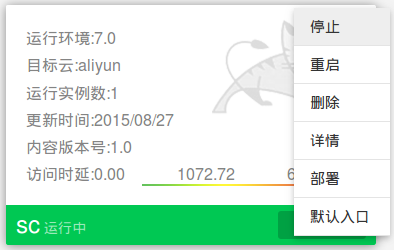

###灰度升级和一键部署

在上一章，用户已经在Sailing Cloud上成功创建第一个**su**应用，该应用较为简单，本章我们将为该应用添加一些新的复杂功能，并示范对其进行一些扩展性操作，向用户演示应用运维。

创业团队的项目具有周期短、业务爆发快等特点，应用的发布升级非常频繁，领航云提供的灰度升级功能保障用户的业务不受中断，版本平滑过渡，以“su”应用为例，点击该应用图标右上角操作按钮，在下拉窗口中选择“部署”。

用户在部署页面可重新从选择war包库中选择war包，或者从本地上传应用包。点击“灰度升级”按钮，可对应用进行灰度升级，完成设置后，点击开始部署按钮，进行灰度升级。

升级后的应用的图标会显示灰度升级信息，

 
该su应用图标中多了一项信息，显示应用正从1.0向1.1.1版本升级，点开绿色详情按钮，总览页面底部显示流量比例控制条，用户可通过逐步调节访问流量控制新老版本的受访问情况，最终实现应用平滑过渡。

