#Sailing Cloud入门教程
 

欢迎用户使用Sailing Cloud，Sailing Cloud是基于Docker容器技术的行业领先的混合云解决方案提供商，在本教程中，用户将逐步学习如何注册用户、获取镜像安装文件、开始创建的一个应用、自动部署，进行应用相关操作，并实现应用性能监控管理等，最后本教程将举例说明Sailing Cloud如何实现从应用创建、部署、灰度升级和运维管理等全生命周期的云服务。本入门教程将按以下目录进行。

##注册账户

欢迎来到Sailing Cloud，首先用户需要注册账户，Sailing Cloud对新注册的用户提供免费的试用服务，要想享受这一优惠，体验业界领先的一站式容器云服务，先注册成为Sailing Cloud的用户吧，用户可访问http://10.10.105.72/promoPage/进入Sailing Cloud官网。

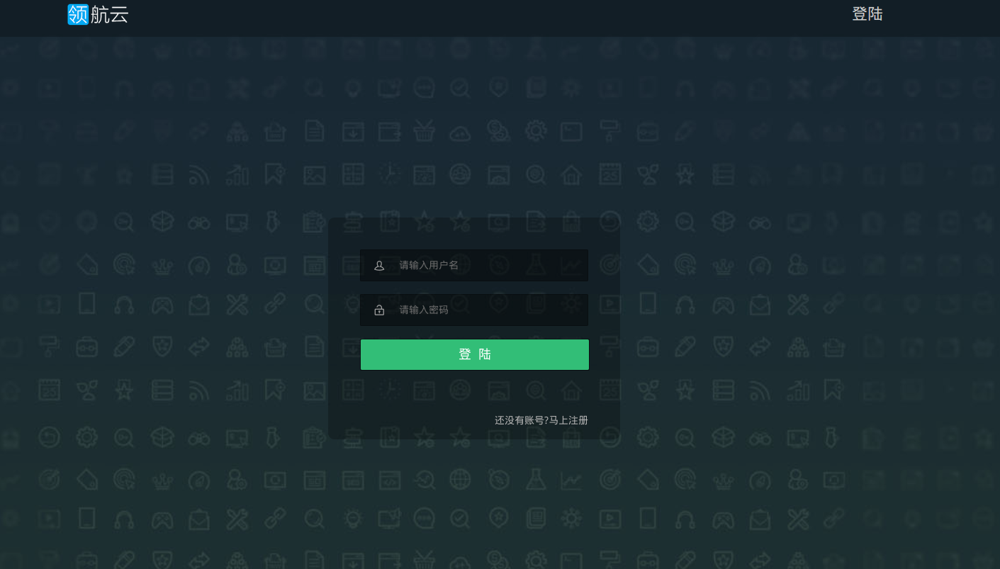

上图是登陆页面，新用户需点击登陆底部的注册按钮，先注册账号。请完善用户资料，确保填写正确的邮箱、电话和公司名称，Sailing Cloud面向中小创业团队，公司技术团队在docker社区享有盛誉提供优惠的收费策略和服务咨询方案，填写正确的用户资料方便用户享受领航云第一手优惠和服务。带星号的选项是必填项，完善资料后，点击注册按钮，完成注册

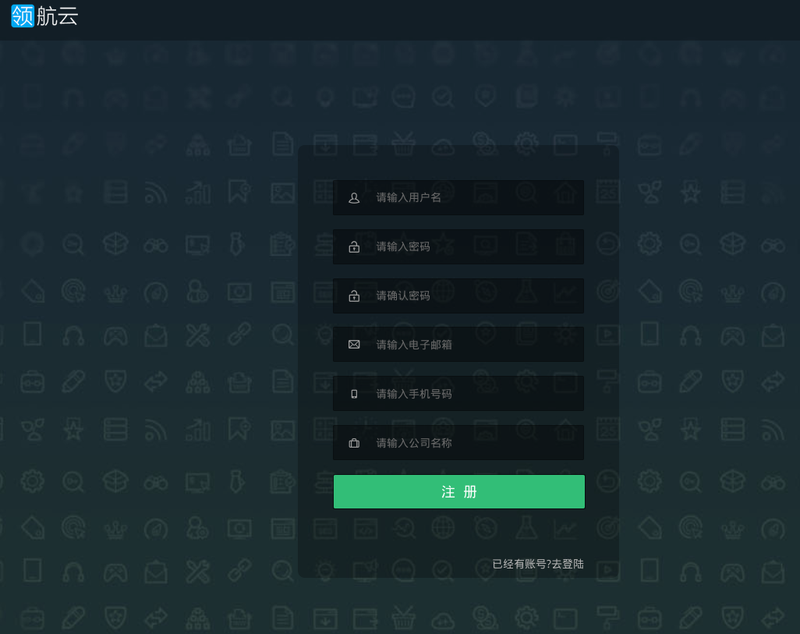

注册成功后，前往邮箱完成相应认证工作后，成功注册，用户注册的用户名和密码得到授权，在后续平台安装工作时是授权凭证，登出并重新访问http://10.10.105.72/promoPage/，输入用户名和密码，点击“登陆”按钮，进入用户界面，登录成功后，页面会进入控制台首页。
##平台安装
用户从Sailing Cloud官方渠道七牛云存储地址获取平台安装文件和部署脚本等，进行平台安装，具体详见[安装部署手册](http://example.com)。
##创建第一个应用

用户完成账户注册和平台安装操作后，进入用户页面，默认进入应用列表页面，现在开始试着创建你的第一个应用，新用户应用列表为空，由于后续演示需求，演示帐号已有应用在运行。点击右下角蓝色控件，弹出两个按钮，分别是：新建应用按钮和War包管理按钮。点击+号按钮，新建应用:

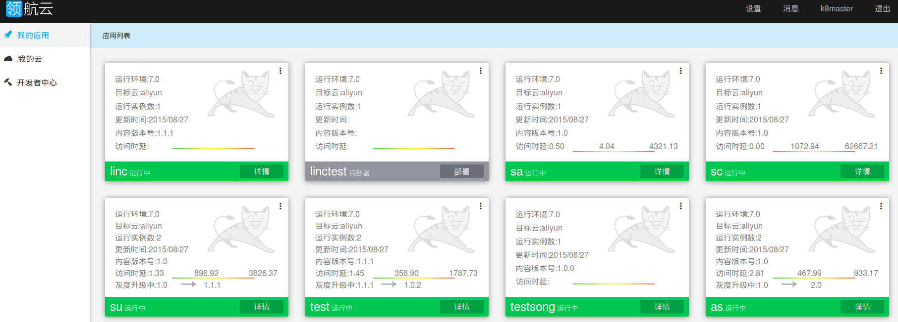

弹出创建应用环境选项卡，用户需按步骤依次配置目标云、应用类型、War包和资源参数。
###选择目标云
该功能是Sailing Cloud一大特色，Sailing Cloud支持主流的IaaS服务提供商，如阿里云等，还可显示用户当前剩余的内存容量和存储容量，方便用户对IaaS资源池的容量有一个概括了解。

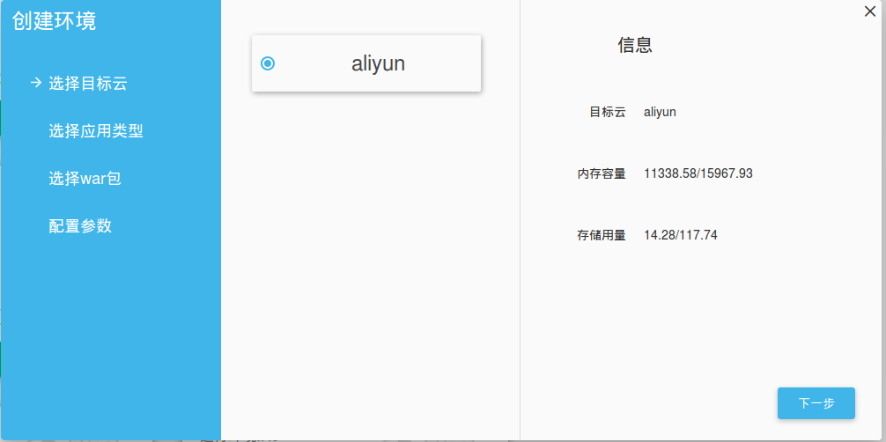

###选择应用类型
为应用选择语言框架，如Java、Python、Ruby等，举例，选择Java语言，选择JDK版本和Tomcat版本。

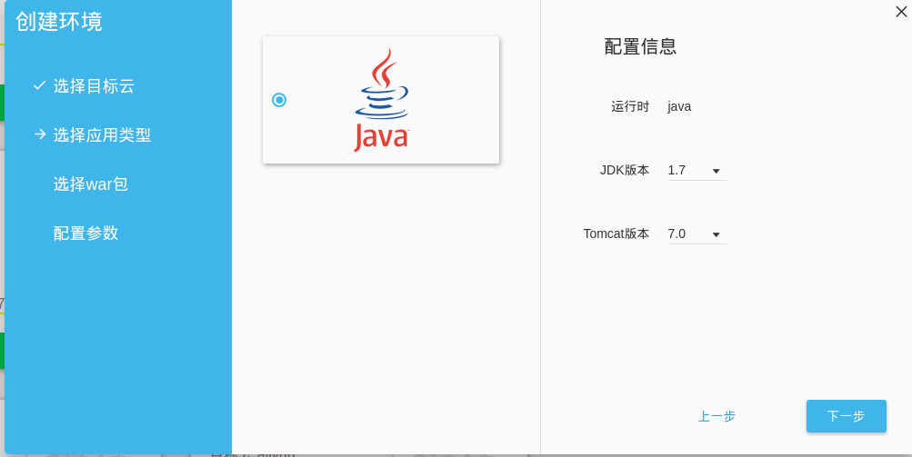

###选择War包
接下来配置War包，用户可从已有的War包列表中进行选择，或者上传一个新War包进行使用。

###配置参数
最后配置应用的资源参数，如环境名称、域名、硬盘、内存、CPU和实例数，除了环境名称需要手动输入，其他选项有默认参数，完成配置后，可将此应用设为入口应用，此应用作为默认入口。最后点击**创建环境**按钮，应用开始自动部署。

举例，新建**su**应用，成功配置环境，创建成功后的应用出现在应用列表中，如下：
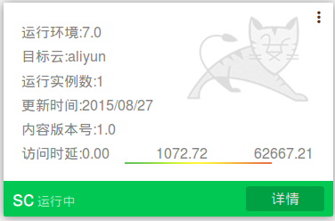

如上，“su”应用自动部署，并成功运行，应用图标上显示该应用的运行环境、目标云、运行实例、更新时间、版本号和访问时延。

###灰度升级和一键部署

在上一章，用户已经在Sailing Cloud上成功创建第一个**su**应用，该应用较为简单，本章我们将为该应用添加一些新的复杂功能，并示范对其进行一些扩展性操作，向用户演示应用运维。

创业团队的项目具有周期短、业务爆发快等特点，应用的发布升级非常频繁，领航云提供的灰度升级功能保障用户的业务不受中断，版本平滑过渡，以“su”应用为例，点击该应用图标右上角操作按钮，在下拉窗口中选择“部署”。

用户在部署页面可重新从选择war包库中选择war包，或者从本地上传应用包。点击“灰度升级”按钮，可对应用进行灰度升级，完成设置后，点击开始部署按钮，进行灰度升级。

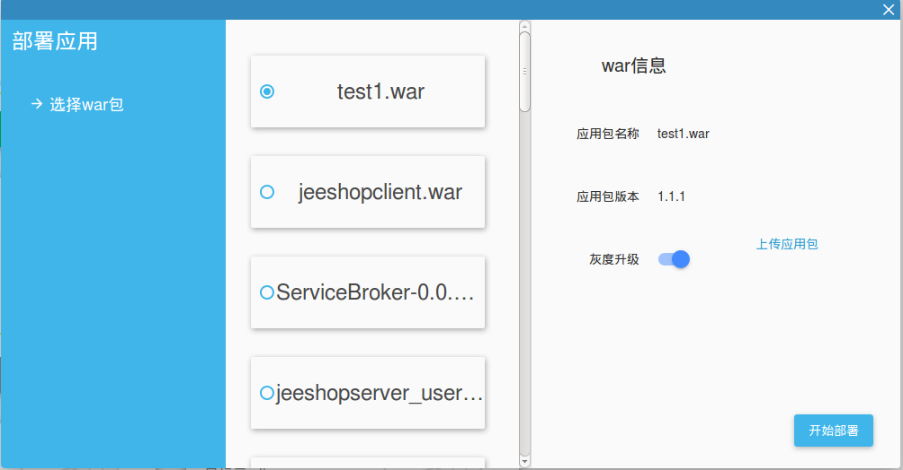

升级后的应用的图标会显示灰度升级信息，

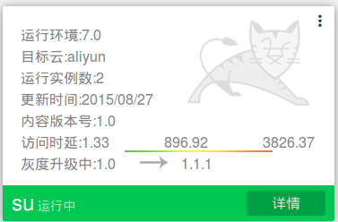

 
该su应用图标中多了一项信息，显示应用正从1.0向1.1.1版本升级，点开绿色详情按钮，总览页面底部显示流量比例控制条，用户可通过逐步调节访问流量控制新老版本的受访问情况，最终实现应用平滑过渡。
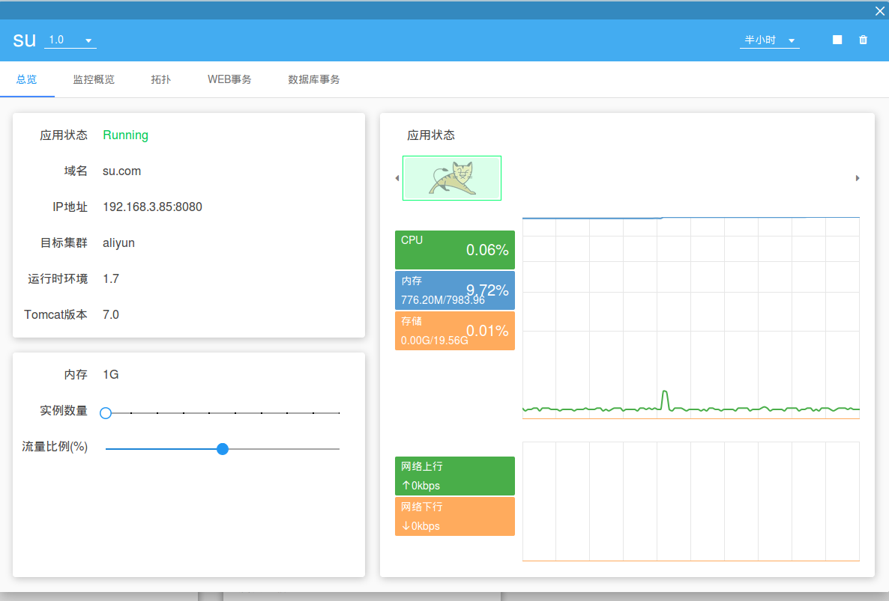

###应用性能监控管理

Sailing Cloud提供一系列性能管理服务，包括监控告警、日志采集分析、性能分析等，提高日常运维效率。将开发者从运维监控工作中解放出来，专注业务实现。对于创业者而言，保证业务正常运行，并提供运维管理是不可或缺的。以su应用为例，用户可从应用图标右上角进入应用详情页。点击应用图标右上角操作按钮，在下拉菜单中选择详情按钮，查看应用运维管理情况。
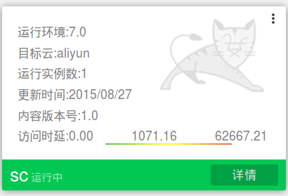

应用详情页有五个部分，分别是总览、监控概览、拓扑、Web事务、数据库事务。在右上角有一系列操作按钮，从左到右依次是应用监控时间段、停止按钮和删除应用按钮。注意，这里删除应用，但仍然保留应用环境，用户可保留环境，方便再次创建应用。

####总览
 默认进入总览页面，总览页面分左右两部分区域，在左侧区域，从上至下，用户可依次查看应用的运行状态、域名、IP、目标集群、运行时环境及Tomcat版本，还有该应用资源使用情况，如内存、存储和实例数。如果是处于灰度升级状态的应用，还会在实例数量下方出现流量控制条，如上一章所示。在总览右侧区域，以图表形式显示了应用的运行和资源状况，包括Tomcat状态图、资源走势图和网络上下行图。
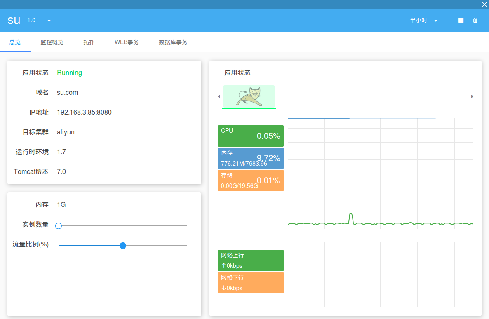

####监控概览
在应用概览页面，用户可查看应用性能情况，如执行时间、吞吐量和错误率，用户可了解阶段时间内应用健康状况变化情况，并获取第一手实时监控数据。
 

1.  执行时间区域，用户就鼠标移到曲线上，会显示该时间点的执行时间，用户可有效捕捉执行冗长的高峰期。
2.  同样，会显示实时的吞吐量，可捕捉吞吐量巨大的高峰期
3.  错误率区域显示实时的错误率。

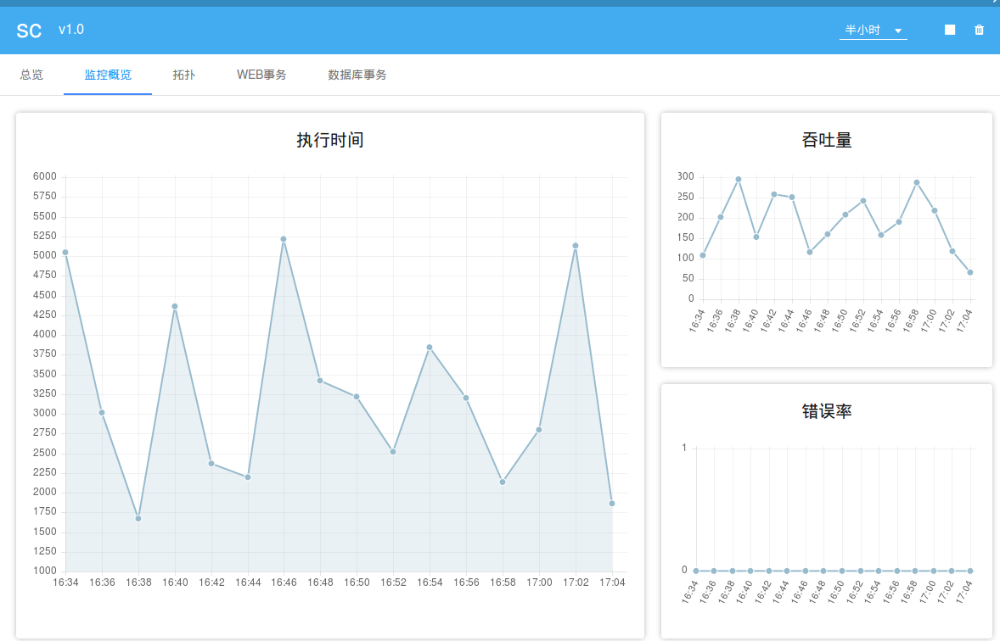

####拓扑
在拓扑页面，用户可查看当前应用网络拓扑情况，包括调用情况、访问延时、访问次数等，反应该应用网络结构情况，用户可通过拓扑图简明地了解到应用是否健壮，初步定位网络性能问题。
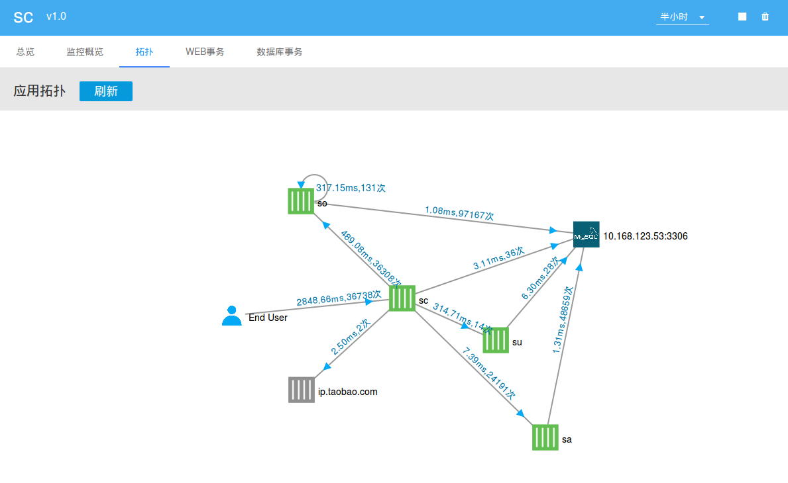

####Web事务
在Web事务页面，用户可查看Web事务的响应时间、吞吐量和慢事务追踪三方面Web事务。
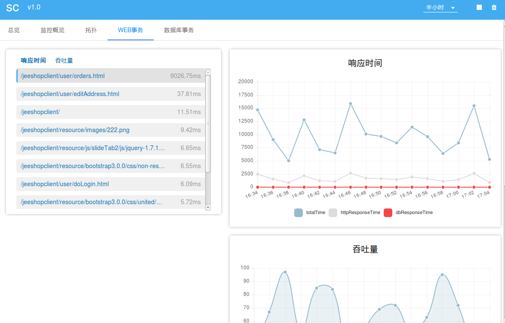

#####响应时间
响应时间表呈现三种曲线图，分别是总体响应时间（total Time，蓝色）、http响应时间（httpResponseTime，灰色)和数据库响应时间（dbResponseTime，红色）。将鼠标拖曳到曲线上，浮现黑色框，标注有各个时间点响应详情。
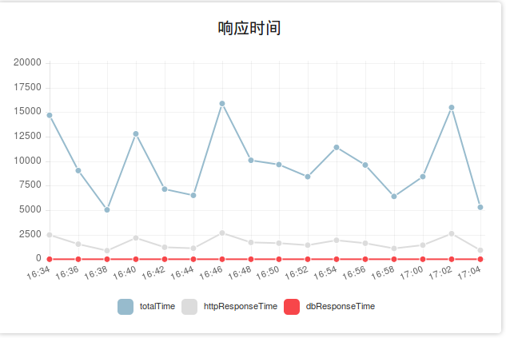

#####吞吐量
图中显示该应用吞吐量曲线图，列出应用实时吞吐量。
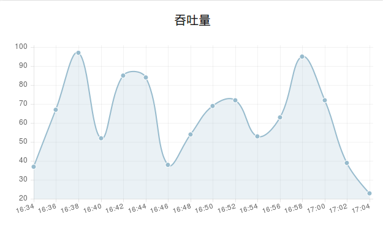

#####慢事务追踪
该区域列出慢事务列表，说明慢事务开始时间、持续时间和运行的节点，用户通过该列表可精确定位慢事务，快速解决慢事务。
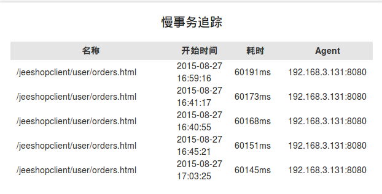

####数据库事务
在数据库事务页面中，用户可查看各个节点的数据库调用响应时间和吞吐量，在响应时间和吞吐量列表区域中，用户选中单条数据库事务，显示该数据库事务的响应时间、吞吐量和调用者分布图。
**数据库响应时间**：选中数据库事务，显示该事务响应时间曲线表	
**数据库吞吐量**：选中数据库事务，显示该事务吞吐量曲线表	
**调用者分布**：选中数据库事务，显示该事务调用者分布饼状图
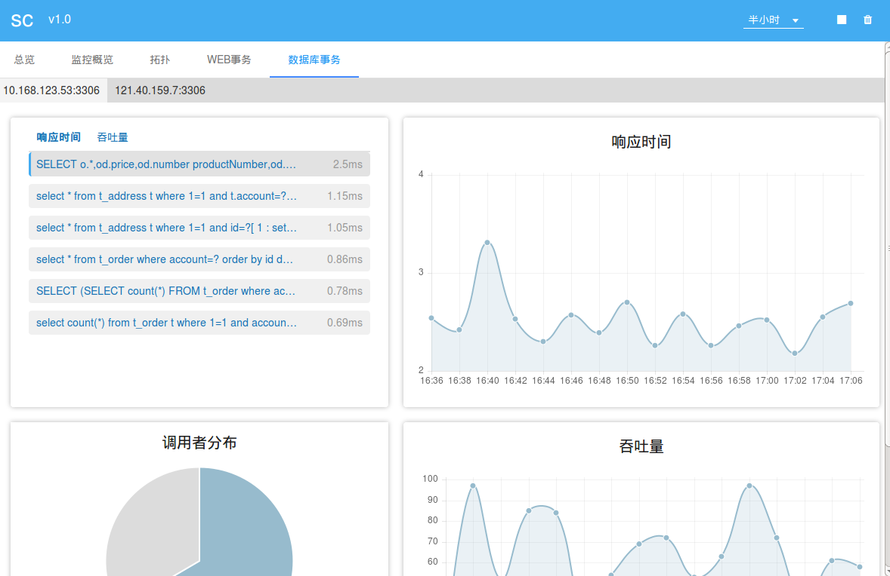

###混合云管理

用户的应用运行在不同基础云服务上，Sailing Cloud提供对混合云上应用的管理，用户可在Sailing Cloud上查看用户所有的IaaS云服务，不同基础云供应商都可进行统一管理。包括主机数量、创建时间、内存总量、存储总量和CPU总核数。
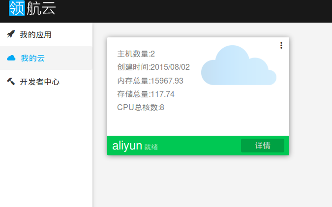

点击云图标绿色详情按钮，进入混合云管理详情页，默认进入总览页面。在总览页面，在左侧，用户可查看所拥有的阿里云服务的资源情况，在右侧，用户可查看网络情况，网络上行和下行时的平均值、峰值和峰值出现时间。

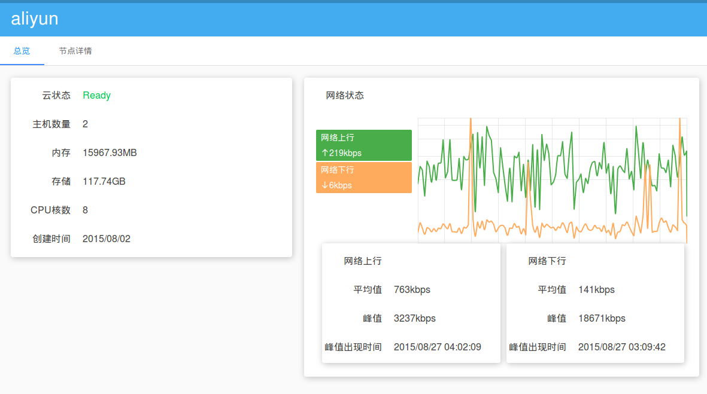

点击进入节点详情页，左上角显示当前节点列表，用户可点击查看不同节点的详情，包括CPU、内存和存储占用率详情图，以及各网卡网络情况。
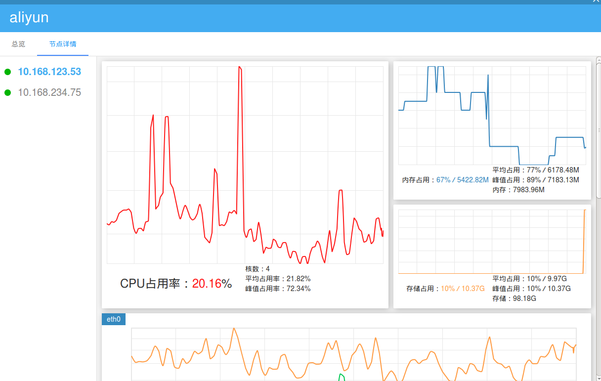

在节点详情页下半部分，用户可查看当前云主机的各网卡的网络上下行情况，以及平均和峰值网络占用。
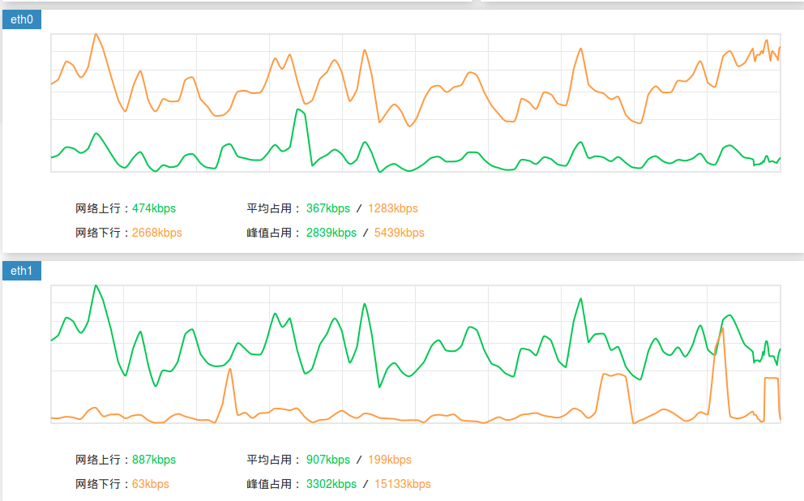

