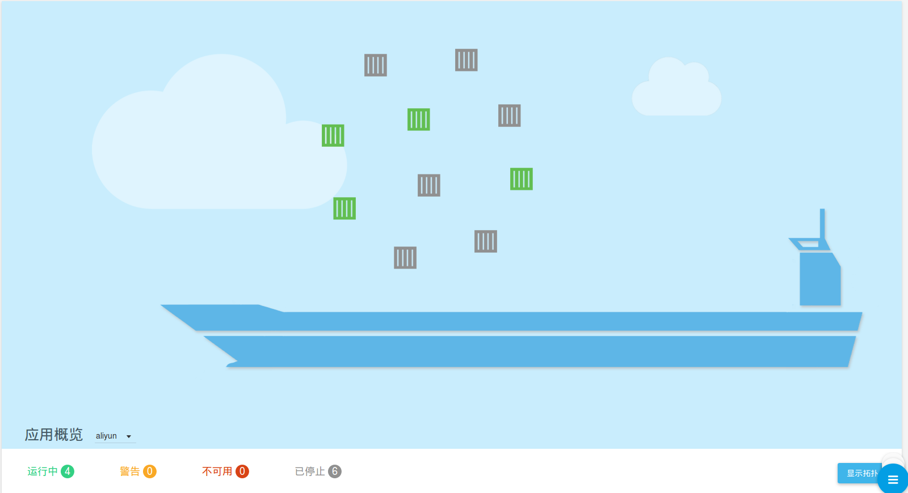
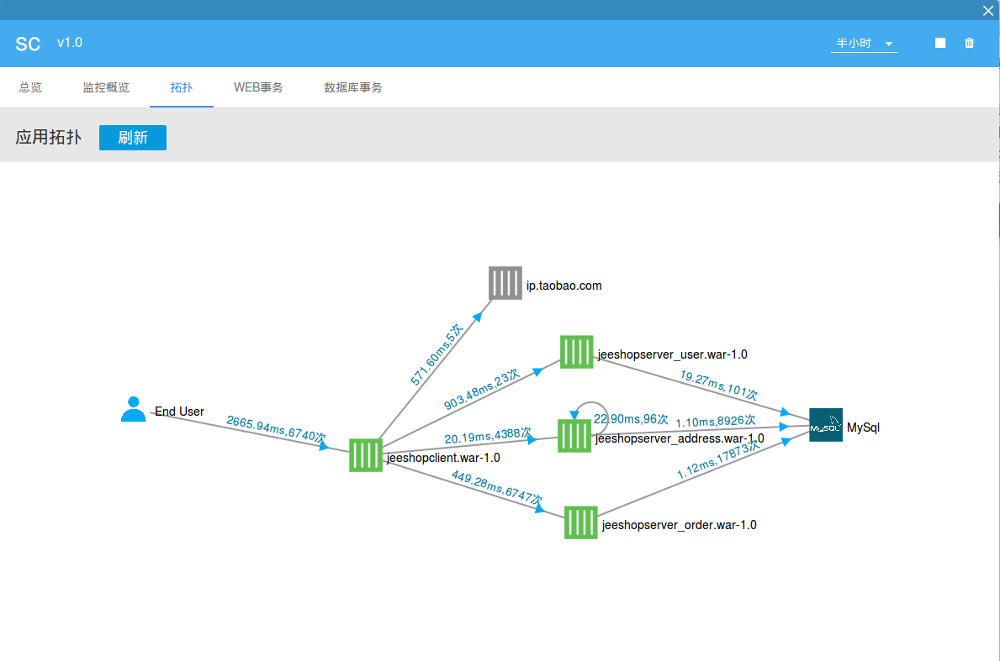

##拓扑管理

领航云提供对应用的拓扑管理，拓扑管理分为两个层级,分别针对单个应用的拓扑和整个目标云上的拓扑:
* 
**单个应用拓扑**
* 
**目标云上的应用拓扑**

###目标云上的拓扑管理
目标云上的拓扑呈现方式是在货船上的集装箱。用户可在应用列表下方的概览区域查看拓扑图,正常情况下是一个个悬浮的集装箱,绿色代表正处于
。
在底部显示目标云的**应用概览**,包括当前处于运行中、警告、不可用和已停止的应用数。不同颜色对应不同状态，绿色代表正常运行、黄色代表警告、红色代表不可用、灰色代表已停止。

点击右下角"显示拓扑"按钮，拓扑概览区域显示拓扑连线图。拓扑图是可拖曳的，方便用户拖曳查看，理解应用war包之间的拓扑关系，了解应用节点之间相互调用关系、时延及次数。整个拓扑结构图简明直观。

###单个应用的拓扑管理
除了查看整个目标云上的应用拓扑，用户还可查看单个应用的拓扑，点击单个应用的图标，点击进入详情页，进入拓扑页面，在这里可查看该应用的拓扑关系。

终端用户调用各War包、访问ip和mySQL数据库等网络结构形成整个拓扑图。

