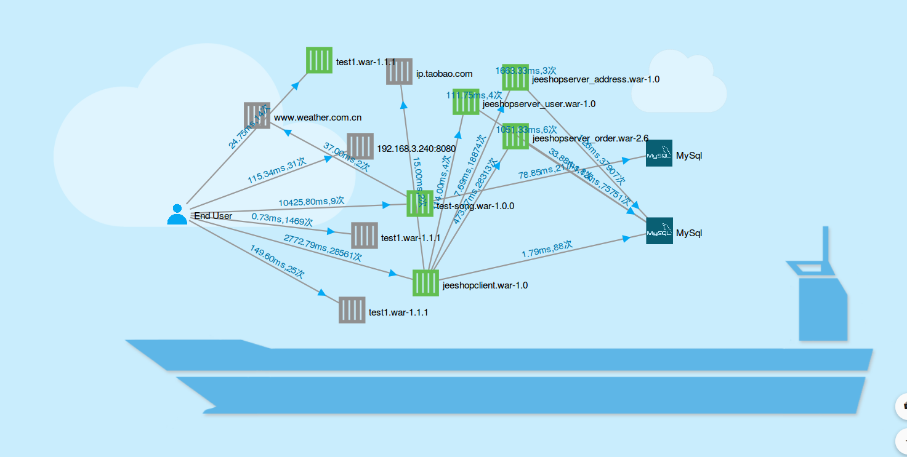

#拓扑管理

领航云提供对应用的拓扑管理，拓扑管理分为两个层级,分别针对单个应用的拓扑和整个目标云上的拓扑:
* 
**单个应用拓扑**
* 
**目标云上的应用拓扑**

##目标云上的拓扑管理
目标云上的拓扑呈现方式是在货船上集装箱式的连线图。一个个“集装箱”代表运行在目标云上的应用，用户可在操作台应用列表下方的概览区域查看拓扑图，此外，拓扑图是动态的，用户可进行一些交互性操作，方便理解应用war包之间的拓扑关系，了解应用节点之间相互调用关系、时延及次数。

用户可拖动应用War包，绿色图标表示该应用处于正常运行状态，灰色表示该节点目前处于停止状态。整个拓扑结构图简明直观。
在底部应用概览区域，如红圈位置，可选择目标云，查看处于应用的状态，分别是运行中、警告、不可用和已停止应用。

