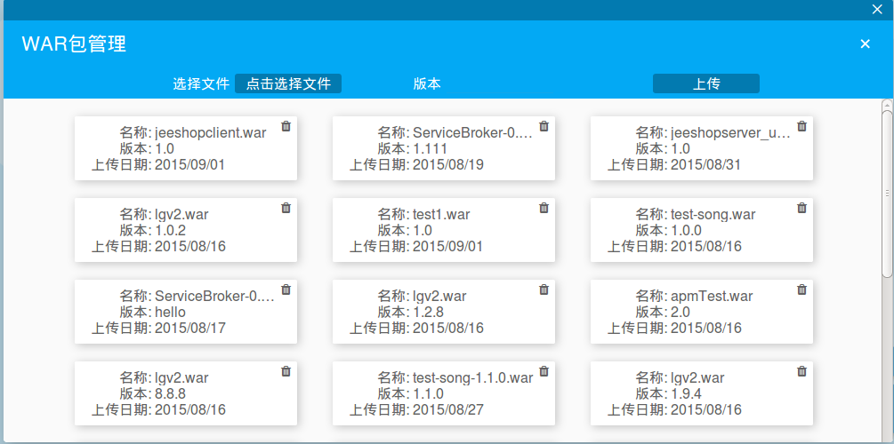

##War包管理

应用War包是由领航云打包直接部署到容器中的文件，通过War包直接构建应用，领航云提供对War包的统一管理，保障用户War包安全可靠。

###war包库

在“我的应用”页面，用户点击右下角蓝色按钮，弹出两个操作按钮：

* 
**新建应用按钮**
* 
**War包管理按钮**

点击War包管理按钮，弹出页面，用户可在该页面进行War包管理操作。

用户可对War包进行删除操作，也可点击右上角添加按钮，上传War包，从本地上传War包、输入版本号，最后点击上传按钮，完成上传。上传后的War包会出现在War包列表里，。

###使用War包
用户在建立War包库后，即可使用War包构建应用，war包主要有两种使用情景:
* 
**创建新应用**
* 
**重新部署应用**

####使用War新建应用
在新建应用情景中，用户在“我的应用”页面点击右上角的**+**号按钮，在创建应用环境时，系统会提示用户从War包库中进行选择，或者直接从本地上传应用War包。

####使用war包重新部署应用
用户如果想要更改应用，需要对应用进行重新部署，点击应用图标右上角按钮，在弹出的下拉框中选择**部署**按钮，以“**SC**”应用为例：

在部署页面，系统提示用户重新选择War包，用户还可在重新部署页面中进行灰度升级。见
