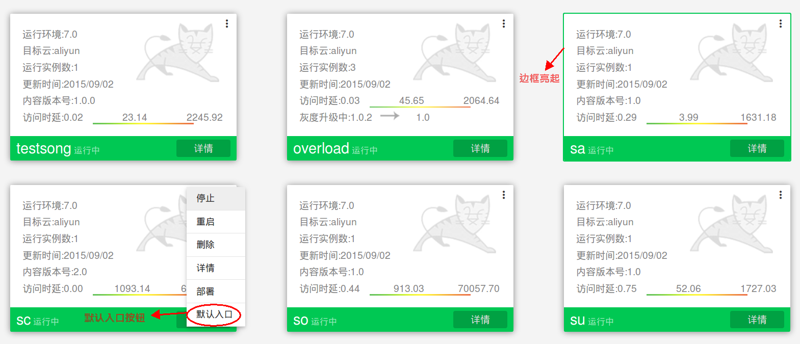
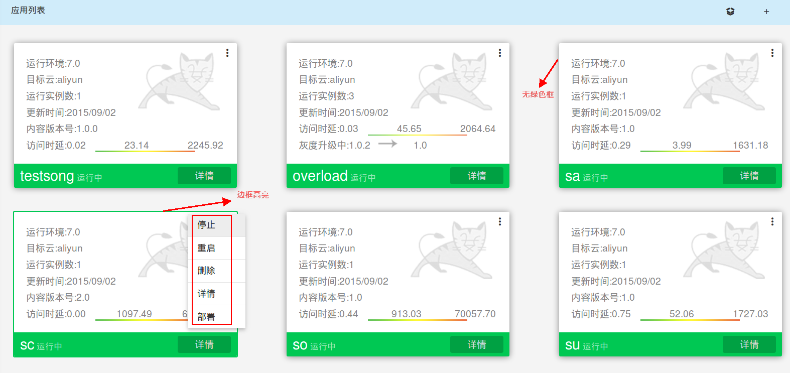

##域名管理

SailingCloud提供简便先进的域名管理，用户在创建应用环境时，最后一步会提示用户设置应用参数，可参见[创建第一个应用](https://183.129.190.82:9000/docs/content/SailingCloud%E5%85%A5%E9%97%A8%E6%95%99%E7%A8%8B/chuang_jian_di_yi_ge_ying_yong.html)。

在该图中，用户有两种选择：
* 为应用绑定备案域名

* 直接将应用设为入口应用。

###绑定备案域名
SailingCloud只支持绑定备案过的域名。用户在SailingCloud创建应用环境时，在参数设置环节，允许输入并绑定一个**备案过的的域名**，创建成功后通过这个域名来访问应用。

###默认入口设置

如果采用前一种方法，就会面临域名备案流程长、业务变化等情况。SailingCloud支持用户对应用进行默认入口设置，默认入口承担外部访问入口的作用，外部的访问将自动访问默认入口应用。SailingCloud通过gorouter中间件，通过一些配置，将外部访问路由到入口应用，用户可快速构建应用、测试和投入使用。

一个集群上只允许设置一个入口应用，集群上的相关应用可以通过内部网络进行配置和访问。

用户有两种默认入口设置情景：
* 
新建默认入口应用
* 
更改默认入口应用

第一种情况详见详见[创建第一个应用](https://183.129.190.82:9000/docs/content/SailingCloud%E5%85%A5%E9%97%A8%E6%95%99%E7%A8%8B/chuang_jian_di_yi_ge_ying_yong.html)，里面有设置默认入口的选项。

####更改默认应用入口
举例说明，当前应用列表下，**sa**应用边框高亮，显示该应用是默认入口应用。

点击想要设为默认入口应用图标，以**sc**应用为例，在右上角弹出框中，点击默认入口按钮，**sc**应用图标边框高亮，默认入口按钮消失，显示当前默认入口应用变更为SC应用。

