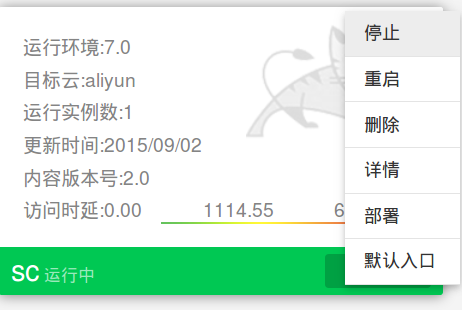
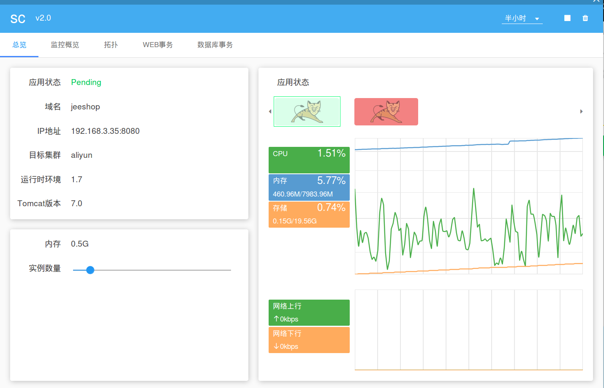

##应用管理

领航云提供对生命周期内丰富的应用管理功能，包括对应用的设置、生命周期操作、实例弹性伸缩、及灰度升级等。
* 
**默认入口设置**
：将应用设置为默认入口，使
* 
**生命周期操作**
：包括对应用进行停止、删除、重启、查看详情和部署等操作。
* 
**弹性伸缩**
：调整应用实例数，支持大规模水平集群扩展，满足业务变化需求，有效应对波峰波谷变化。
* 
**灰度升级**
：提供灰度升级功能，应用无缝迁移，满足版本平滑过渡需求。

###默认入口设置

SailingCloud支持用户对应用进行默认入口设置，默认入口应用承担云主机外部接口的作用。

###生命周期操作
支持对应用进行全生命周期操作，从应用成功运行后，进行停止、删除、重启、详情查看和重新部署等操作。

###弹性伸缩
用户可针对业务需求，用户在控制台通过简单的操作，可动态调整实例数。以下图为例，滑动底部的实例滑条，右侧应用状态区域显示一个正处于启动状态的Tomcat。部署成功后，新的Tomcat图标变为绿色，显示实例成功扩展。

###灰度升级
SailingCloud为满足创业团队频繁迭代发布的特点，推出灰度升级功能，保证用户业务平滑过渡，具体可参见“SailingCloud入门手册”**灰度升级与一键部署**一章。
