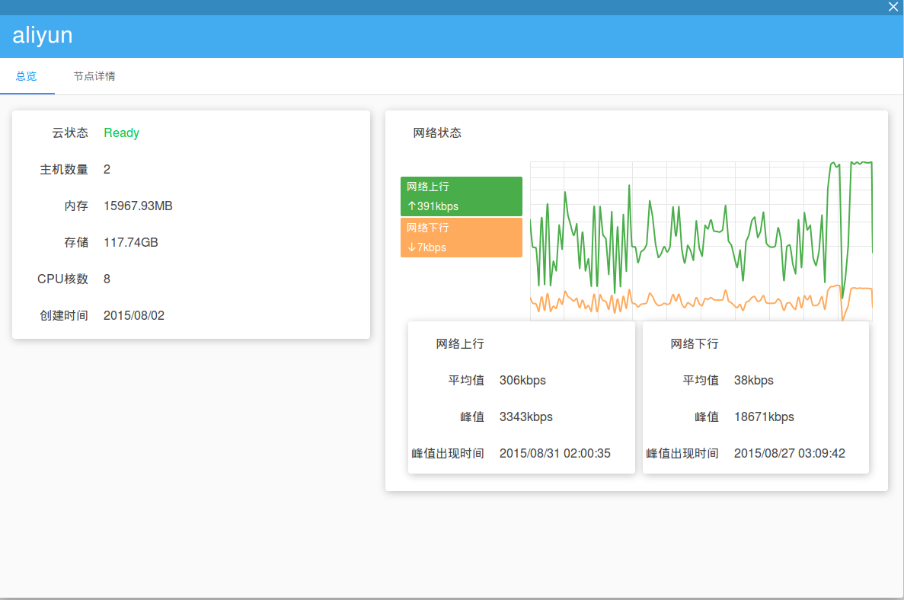
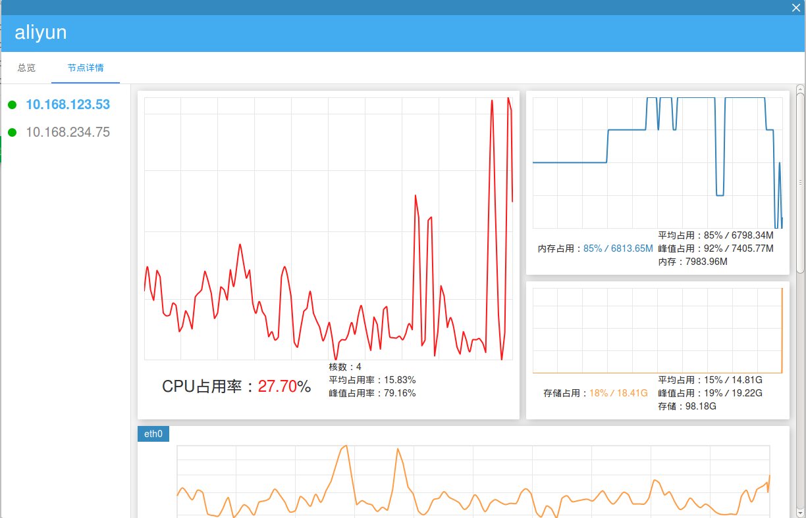

##云主机管理    
SailingCloud支持用户在不同IaaS云服务商上的主机统一管理，用户可在SailingCloud控制台中查看云主机的资源占用、网络情况、节点状况等信息。在**我的云**页面中，会显示当前用户拥有的云主机情况。目标云图标上显示主机数、创建时间、内存总量、存储总量和CPU总核数。

###云主机总览
点击目标云图标右下角的详情按钮，进入目标云详情页。默认进入总览页面，在左侧用户可查看云主机的资源信息，右侧显示网络状态图。

###节点详情
用户还可查看云主机节点运行情况，包括选中节点的资源占用：CPU、内存和存储，以及相应网关的网络上下行等情况。具体使用教程可参见“**领航云入门教程**。
